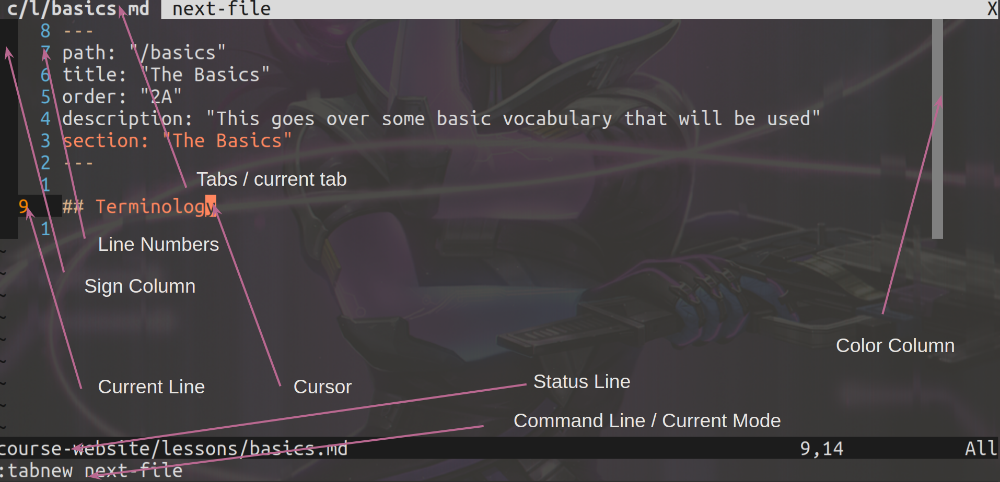

## Files, Buffers, Windows, Splits, and Tabs
We all know what files are (or so you think [LiveOverflow's Video on
Files](https://www.youtube.com/watch?v=VVdmmN0su6E)) but there is a bit more
when it comes to how vim handles them.

### Buffer
A buffer contains the text of the file and is what you edit.

`:h buffer`

### Window
Contains a buffer to display.  Windows can be closed but the underlying buffer
can remain in memory.

`:h window`

### Tabs
A tab is like another viewport.  You can have many windows|splits open per tab.

`:h tab`

### Splits
A split simply refers to splitting the viewport in N sections (various sizing
and orientations available) to display windows.

`:h split`

## Other Terminology

## Help Menu
Help menu can be accessed by typing `:h<enter>`.  There is _so much
documentation_, that is pretty good, available.  If you find yourself lost,
RTFM (at least that is what they tell me).

## Motion
A command that moves the cursor (taken straight from the help docs, h motion).

## Abbreviations
Ctrl+a will be abbreviated `<C-a>`.  This is also how its referenced in VimL,
Vim's editor language.

Enter will often be abbr as `<CR>`

Tab, Escape, and space will be `<tab>`, `<esc>`, `<space>`
